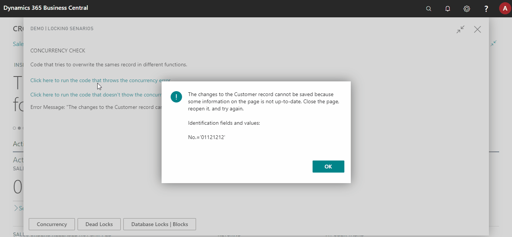

# How to solve Table Locking Issues in Business Central

This repository contains an AL Project with examples that demonstrate Table Locking Errors, Deadlock Errors, and Concurrency Errors and their possible solutions.

You can download the source code and run the Page "Test Database Locks" (50100) to try the different options.

You can read detailed post on this topic at [www.msnJournals.com](https://www.msnjournals.com/post/how-to-solve-table-locking-issues-in-business-central)

